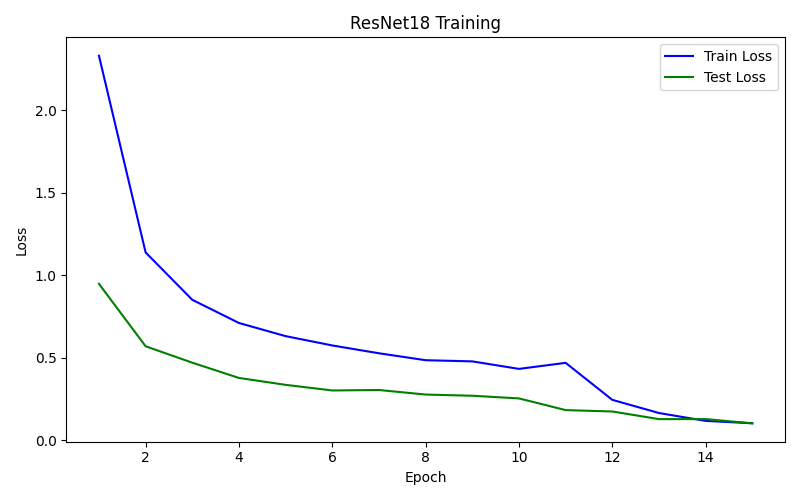
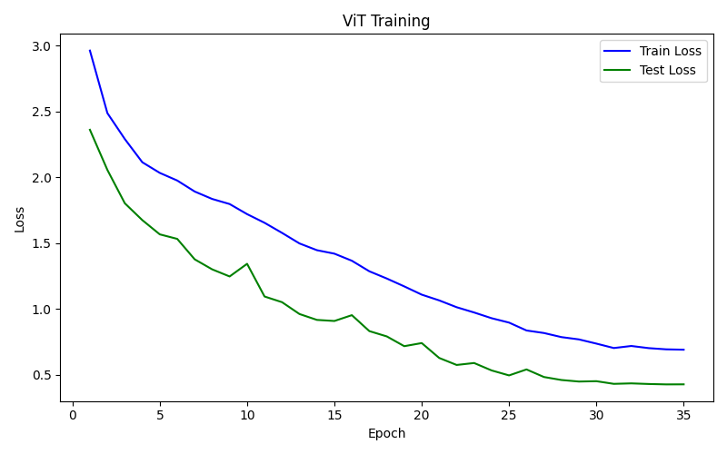
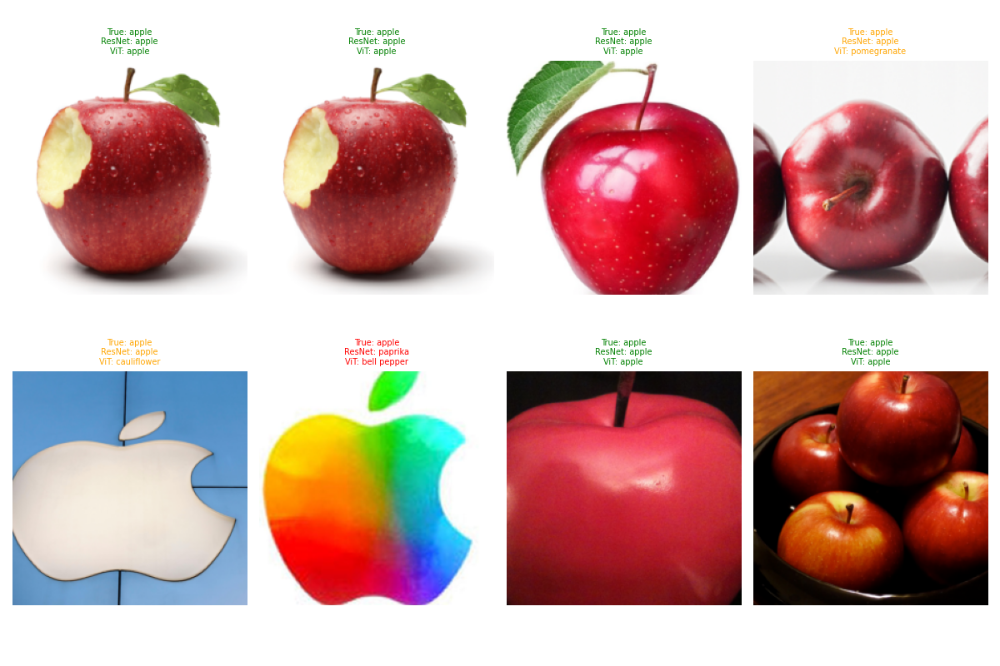
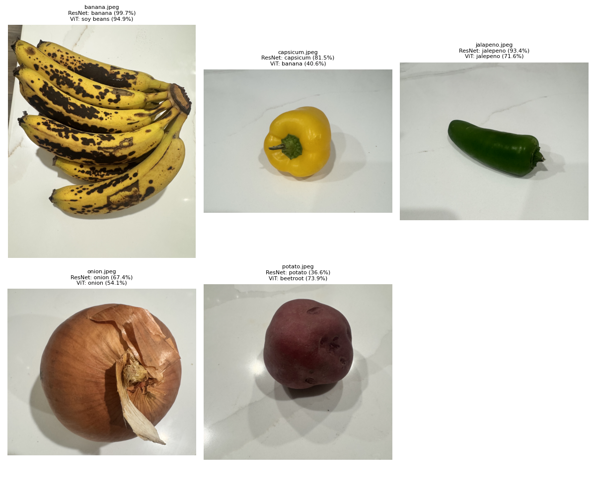

# Grocery Classification: CNN vs. Vision Transformer

**CS5330 - Computer Vision | Final Project**  
**Author: Vineela Goli**  
**Video Link:** https://youtu.be/e8kIKvApRvM  

This project builds and compares two image classification approaches on the Grocery Store Dataset: a pretrained ResNet18 CNN using transfer learning, and a Vision Transformer (ViT) trained from scratch. The goal is to evaluate which architecture performs better on a real-world dataset beyond MNIST, and understand the tradeoffs between the two approaches. Testing will include using a real grocery images taken on my phone to evaluate both models.

---

## Project Overview

This project investigates how two fundamentally different deep-learning architectures perform on a grocery image classification task:

- **ResNet18** — a pretrained CNN fine-tuned via transfer learning
- **ViT (Vision Transformer)** — a custom transformer built from scratch using patch embeddings and multi-head self-attention

Both models are trained on the same dataset and evaluated on held-out test images and real-world grocery photos.

---

## Dataset

Source: https://www.kaggle.com/datasets/kritikseth/fruit-and-vegetable-image-recognition

The dataset (`data/fruits_vegetables/`) contains **36 grocery classes** split into `train/` and `test/` subdirectories:

`apple, banana, beetroot, bell pepper, cabbage, capsicum, carrot, cauliflower, chilli pepper, corn, cucumber, eggplant, garlic, ginger, grapes, jalepeno, kiwi, lemon, lettuce, mango, onion, orange, paprika, pear, peas, pineapple, pomegranate, potato, raddish, soy beans, spinach, sweetcorn, sweetpotato, tomato, turnip, watermelon`

| Split | Batches (batch=32) |
|-------|--------------------|
| Train | 98 |
| Test  | 12 |

**Preprocessing:**
- Train: Resize to 256 → RandomCrop to 224 → RandomHorizontalFlip → Normalize (ImageNet mean/std)
- Test: Resize to 256 → CenterCrop to 224 → Normalize (ImageNet mean/std)

---

## Repository Structure

```
CV_Grocery_Classification_CNN_ViT/
├── src/
│   ├── utils.py                    # Shared data loading, training/testing loops, plotting
│   ├── resnet_model.py             # ResNet18 transfer learning — build, train, save
│   ├── vit_model.py                # ViT built from scratch — build, train, save
│   ├── compare_models.py           # Side-by-side prediction comparison on test set
│   └── compare_models_real_img.py  # Run both models on real grocery photos
├── data/
│   ├── fruits_vegetables/          # Train/test/validation dataset (ImageFolder structure)
│   └── real_photos/                # Real-world grocery photos for evaluation
├── docs/                           # Project proposal, report, and presentation
├── results/                        # Training logs, per-class accuracy tables, plots
├── resnet18_fruits.pth             # Saved ResNet18 model weights
├── vit_fruits.pth                  # Saved ViT model weights
├── ResNet18_Training.png           # ResNet18 loss curve
├── ViT_Training.png                # ViT loss curve (20 epochs)
├── ViT_Training2.png               # ViT loss curve (35 epochs)
├── comparison.png                  # Side-by-side predictions on test batch
└── real_photo_results.png          # Predictions on real grocery photos
```

---

## Models

### ResNet18 (Transfer Learning) — `resnet_model.py`

Loads a pretrained ResNet18, freezes the base layers, and replaces the final fully-connected layer to output 36 classes. Training proceeds in two phases:

| Phase | Epochs | LR | Notes |
|-------|--------|----|-------|
| 1 — Head only | 10 | 1e-3 | Base layers frozen; only FC head trained |
| 2 — Full fine-tune | 5 | 1e-4 | All layers unfrozen |

**Optimizer:** Adam | **Loss:** CrossEntropyLoss

### Vision Transformer (From Scratch) — `vit_model.py`

Custom ViT adapted for 224×224 RGB images with the following configuration:

| Hyperparameter | Value |
|----------------|-------|
| Image size | 224×224 |
| Patch size / stride | 16×16 (non-overlapping) |
| Number of tokens | 196 (14×14) |
| Embedding dim | 192 |
| Transformer depth | 6 layers |
| Attention heads | 6 (32 dim/head) |
| MLP dim | 384 |
| Dropout | 0.1 |
| Epochs | 35 |
| LR | 1e-3 (cosine annealed) |
| Weight decay | 1e-4 |

**Optimizer:** AdamW | **Loss:** NLLLoss | **Scheduler:** CosineAnnealingLR

The ViT uses mean token pooling (no CLS token) before a two-layer classifier head with GELU activation.

---

## Results

### ResNet18 — Final Accuracy: **97.49%** (15 total epochs)

| Epoch | Train Loss | Test Accuracy |
|-------|-----------|---------------|
| 1 (Phase 1) | 2.3291 | 79.67% |
| 5 (Phase 1) | 0.6306 | 92.48% |
| 10 (Phase 1) | 0.4322 | 92.48% |
| 11 (Phase 2, FT1) | 0.4688 | 93.04% |
| 13 (Phase 2, FT3) | 0.1648 | 95.54% |
| **15 (Phase 2, FT5)** | **0.1028** | **97.49%** |

Notable per-class results: 29 of 36 classes reached 100% accuracy. Weakest classes: banana (77.8%), potato (80.0%).



---

### ViT — Final Accuracy: **90.81%** (35 epochs)

Initial 20-epoch run peaked at 78.27%. Extended to 35 epochs:

| Epoch | Train Loss | Test Accuracy |
|-------|-----------|---------------|
| 1 | 2.9616 | 27.30% |
| 10 | 1.7194 | 57.94% |
| 20 | 1.1078 | 78.55% |
| 28 | 0.7852 | 89.42% |
| **35** | **0.6895** | **90.81%** |

Notable per-class results: 18 of 36 classes reached 100% accuracy. Weakest classes: apple (50.0%), lettuce (50.0%).



---

### Side-by-Side Comparison — `compare_models.py`

On a held-out test batch of 8 images:

| Outcome | Count |
|---------|-------|
| Both correct | 5 |
| One correct | 2 |
| Both wrong | 1 |



---

### Real Grocery Photos — `compare_models_real_img.py`

Both models evaluated on 5 real-world photos from `data/real_photos/`:

| Image | ResNet18 | Confidence | ViT | Confidence |
|-------|----------|-----------|-----|-----------|
| banana.jpeg | **banana** ✓ | 99.7% | soy beans ✗ | 94.9% |
| capsicum.jpeg | **capsicum** ✓ | 81.5% | banana ✗ | 40.6% |
| jalapeno.jpeg | **jalepeno** ✓ | 93.4% | **jalepeno** ✓ | 71.6% |
| onion.jpeg | **onion** ✓ | 67.4% | **onion** ✓ | 54.1% |
| potato.jpeg | **potato** ✓ | 36.6% | beetroot ✗ | 73.9% |

ResNet18: 5/5 correct | ViT: 2/5 correct on real photos.



---

## Summary

| Metric | ResNet18 | ViT (scratch) |
|--------|----------|---------------|
| Test accuracy | **97.49%** | 90.81% |
| Epochs | 15 | 35 |
| Real-photo accuracy | **5/5** | 2/5 |
| Training approach | Transfer learning | From scratch |

ResNet18 outperforms the ViT significantly with fewer epochs due to ImageNet pretraining. The ViT-from-scratch achieves competitive accuracy (90.81%) given the small dataset size, but requires more epochs and is more susceptible to visually similar classes. ViTs typically benefit from large-scale pretraining, making transfer learning the stronger choice for small datasets.

---

## Usage

> Training was run on **Google Colab (GPU)**. Local CPU training is very slow.

**Train ResNet18:**
```bash
python src/resnet_model.py
```

**Train ViT:**
```bash
python src/vit_model.py
```

**Compare models on test set:**
```bash
python src/compare_models.py
```

**Test on real photos** (place images in `data/real_photos/`):
```bash
python src/compare_models_real_img.py
```

---

## Dependencies

- Python 3.11
- PyTorch
- torchvision
- matplotlib
- Pillow

## Acknowledgements
- Used my own project 5 transformers code to adapt to this project
- Used Claude AI to generate this README that is verified and edited by me afterwards
- Used Canva for presentation preparation
- Used Claude AI to find related work papers
- Used Google Colab to run the transformer using the free GPU
