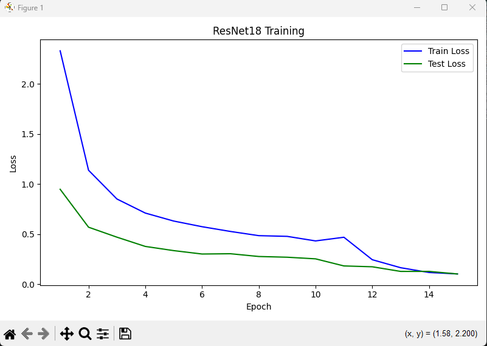

Phase 1: Training classification head (base frozen)
Epoch 1: Train Loss=2.3291, Test Accuracy=79.67%
Epoch 2: Train Loss=1.1376, Test Accuracy=85.79%
Epoch 3: Train Loss=0.8506, Test Accuracy=86.07%
Epoch 4: Train Loss=0.7102, Test Accuracy=89.42%
Epoch 5: Train Loss=0.6306, Test Accuracy=92.48%
Epoch 6: Train Loss=0.5741, Test Accuracy=91.36%
Epoch 7: Train Loss=0.5267, Test Accuracy=91.09%
Epoch 8: Train Loss=0.4848, Test Accuracy=92.20%
Epoch 9: Train Loss=0.4776, Test Accuracy=91.92%
Epoch 10: Train Loss=0.4322, Test Accuracy=92.48%

Phase 2: Fine-tuning full network
Fine-tune Epoch 1: Train Loss=0.4688, Test Accuracy=93.04%
Fine-tune Epoch 2: Train Loss=0.2446, Test Accuracy=93.87%
Fine-tune Epoch 3: Train Loss=0.1648, Test Accuracy=95.54%
Fine-tune Epoch 4: Train Loss=0.1171, Test Accuracy=94.99%
Fine-tune Epoch 5: Train Loss=0.1028, Test Accuracy=97.49%

Per-class accuracy:
Class                      Correct  Total      Acc
----------------------------------------------------
apple                            9     10    90.0%
banana                           7      9    77.8%
beetroot                        10     10   100.0%
bell pepper                      9     10    90.0%
cabbage                         10     10   100.0%
capsicum                        10     10   100.0%
carrot                           9     10    90.0%
cauliflower                     10     10   100.0%
chilli pepper                   10     10   100.0%
corn                             9     10    90.0%
cucumber                        10     10   100.0%
eggplant                        10     10   100.0%
garlic                          10     10   100.0%
ginger                          10     10   100.0%
grapes                          10     10   100.0%
jalepeno                        10     10   100.0%
kiwi                            10     10   100.0%
lemon                           10     10   100.0%
lettuce                         10     10   100.0%
mango                           10     10   100.0%
onion                           10     10   100.0%
orange                          10     10   100.0%
paprika                         10     10   100.0%
pear                            10     10   100.0%
peas                            10     10   100.0%
pineapple                       10     10   100.0%
pomegranate                     10     10   100.0%
potato                           8     10    80.0%
raddish                         10     10   100.0%
soy beans                       10     10   100.0%
spinach                         10     10   100.0%
sweetcorn                        9     10    90.0%
sweetpotato                     10     10   100.0%
tomato                          10     10   100.0%
turnip                          10     10   100.0%
watermelon                      10     10   100.0%

