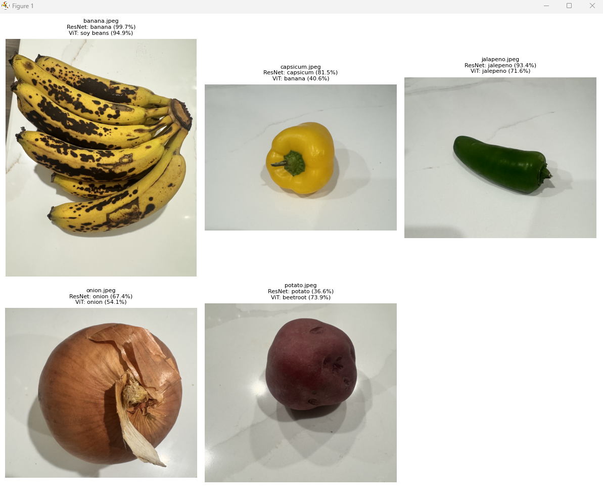

Found 5 image(s). Running predictions...

Filename                  ResNet                   Conf   ViT                      Conf
------------------------------------------------------------------------------------------
banana.jpeg               banana                  99.7%   soy beans               94.9%
capsicum.jpeg             capsicum                81.5%   banana                  40.6%
jalapeno.jpeg             jalepeno                93.4%   jalepeno                71.6%
onion.jpeg                onion                   67.4%   onion                   54.1%
potato.jpeg               potato                  36.6%   beetroot                73.9%

